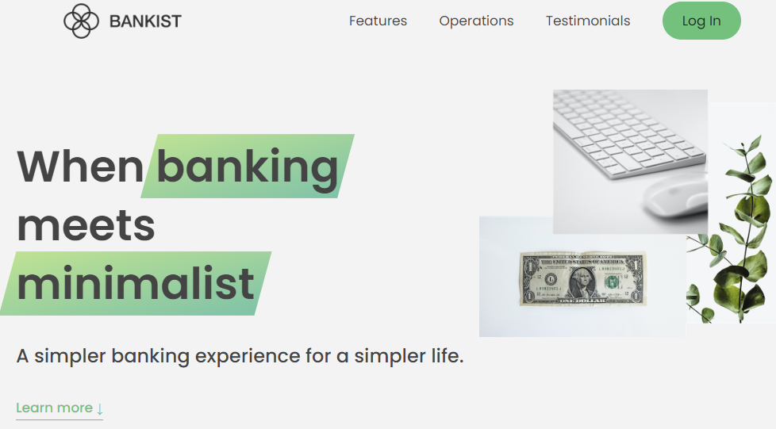
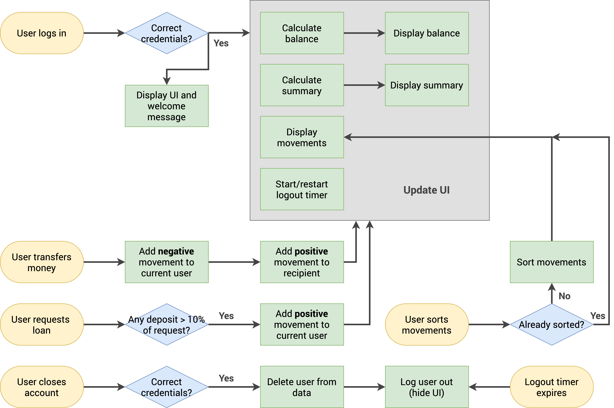

 

<h1 align="center">🏦 <a href="https://bankist-mvidicek.netlify.app">Bankist</a></h1>

  

    Minimalistic Banking Web Application (JS | HTML | CSS)  
    A Project used to learn advanced DOM manipulation techniques
    

  

  

## Techniques Learned
- Smooth scroll
- Page Navigation
- Tabbed component
- Menu fade animation
- Sticky navigation
- Lazy loading images
- Slider component
- Reveal sections

## Features
- ✔️ Login, Logout
- ✔️ Transfer Money
- ✔️ Request Loan
- ✔️ Close Account

------------

  

## Usage
Users: mv, jd  
Passwords: 1111, 2222

## Credits
This project was developed in The Complete JavaScript Course:
https://www.udemy.com/course/the-complete-javascript-course/

Created by **Jonas Schmedtmann**  
Developed by **Marko Vidiček**

<!-- MARKDOWN LINKS & IMAGES -->
[flowchart-screenshot]: flowchart.png

